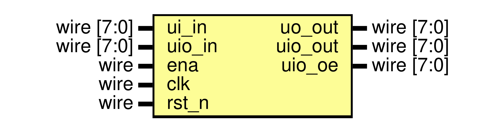
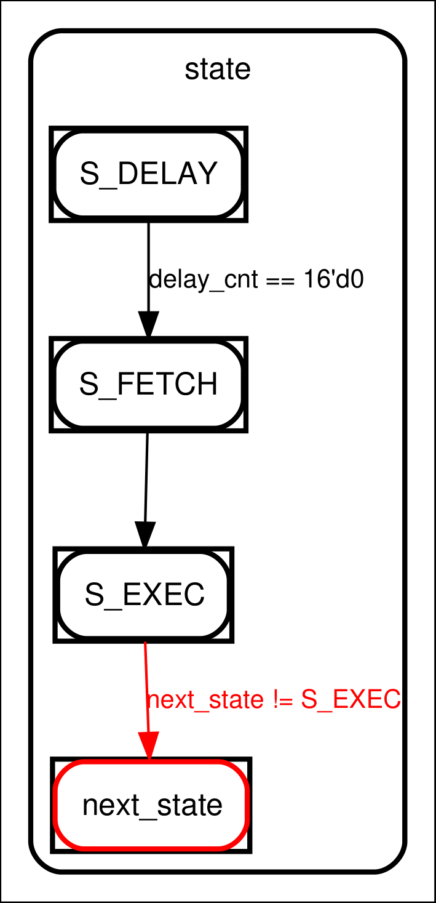

# Entity: protocol_engine

- **File**: protocol_engine.v

## Diagram

## Ports

| Port name | Direction | Type       | Description                                                                                 |
| --------- | --------- | ---------- | ------------------------------------------------------------------------------------------- |
| ui_in     | input     | wire [7:0] | Input-only protocol pins; <code>ui_in[3:0]</code> become logical pins 4-7.                             |
| uo_out    | output    | wire [7:0] | Protocol output latch, or host RX FIFO data during a host read.                             |
| uio_in    | input     | wire [7:0] | Host loader/FIFO controls on bits 0-3 and bidirectional protocol inputs on bits 4-7.        |
| uio_out   | output    | wire [7:0] | Bidirectional protocol output values on bits 4-7; bits 0-3 are zero.                        |
| uio_oe    | output    | wire [7:0] | Per-pin output enables on bits 4-7; bits 0-3 are zero.                                      |
| ena       | input     | wire       | Harness enable input; retained for the standard wrapper interface and not used for control. |
| clk       | input     | wire       | System clock used by the divider, loader, FIFOs, and execution FSM.                         |
| rst_n     | input     | wire       | Active-low asynchronous reset.                                                              |

## Signals

| Name                                                                                                                                      | Type        | Description                                                                                       |
| ----------------------------------------------------------------------------------------------------------------------------------------- | ----------- | ------------------------------------------------------------------------------------------------- |
| imem [0:31]                                                                                                                               | reg [15:0]  | 32-word instruction memory; reset fills it with HALT instructions.                                |
| cfg_clkdiv_int                                                                                                                            | reg [15:0]  | Integer part of the system-clock divider.                                                         |
| cfg_clkdiv_frac                                                                                                                           | reg [7:0]   | Fractional divider term accumulated to distribute extra cycles.                                   |
| cfg_wrap_top                                                                                                                              | reg [4:0]   | Highest program address included in the automatic wrap range.                                     |
| cfg_wrap_bottom                                                                                                                           | reg [4:0]   | Lowest program address included in the automatic wrap range.                                      |
| cfg_shift_dir                                                                                                                             | reg [1:0]   | Shift direction: zero emits LSB first; one emits MSB first.                                       |
| cfg_autopull                                                                                                                              | reg         | Enables TX FIFO refill while executing <code>OUT</code>.                                                     |
| cfg_autopush                                                                                                                              | reg         | Enables RX FIFO capture while executing <code>IN</code>.                                                     |
| cfg_pull_thresh                                                                                                                           | reg [4:0]   | Autopull threshold, tested when <code>osr_count</code> is at or below it.                                    |
| cfg_push_thresh                                                                                                                           | reg [4:0]   | Autopush threshold, tested when <code>isr_count</code> is at or above it.                                    |
| cfg_side_count                                                                                                                            | reg [3:0]   | Number of low side-set bits applied to protocol pins 0-3.                                         |
| cfg_side_oe                                                                                                                               | reg         | Selects side-set destination: output value when zero, output enable when one.                     |
| clkdiv_int_cnt                                                                                                                            | reg [15:0]  | Current integer divider countdown.                                                                |
| clkdiv_frac_acc                                                                                                                           | reg [7:0]   | Fractional divider accumulator.                                                                   |
| tick                                                                                                                                      | reg         | One-cycle execution pulse generated when the divider expires.                                     |
| clkdiv_frac_sum = {1'b0, clkdiv_frac_acc}                                                                                                 | wire [8:0]  | Fractional accumulator plus configured fraction, including carry.                                 |
| pc                                                                                                                                        | reg [4:0]   | Program counter for the 32-word instruction memory.                                               |
| instr                                                                                                                                     | reg [15:0]  | Instruction latched during <code>S_FETCH</code> and decoded during <code>S_EXEC</code>.                                 |
| osr                                                                                                                                       | reg [31:0]  | Output shift register consumed by <code>OUT</code> and loaded by <code>PULL</code>/<code>MOV</code>.                               |
| isr                                                                                                                                       | reg [31:0]  | Input shift register filled by <code>IN</code> and whole-bus <code>SAMPLE</code>.                                       |
| osr_count                                                                                                                                 | reg [4:0]   | Number of valid or remaining output bits used by autopull.                                        |
| isr_count                                                                                                                                 | reg [4:0]   | Number of input bits accumulated since the last push.                                             |
| x_reg                                                                                                                                     | reg [7:0]   | General-purpose scratch/count register used by jumps and delays.                                  |
| y_reg                                                                                                                                     | reg [7:0]   | General-purpose scratch/count register used by jumps and delays.                                  |
| pin_out                                                                                                                                   | reg [7:0]   | Latched logical protocol output values.                                                           |
| pin_oe                                                                                                                                    | reg [7:0]   | Latched logical protocol output enables; zero releases a pin.                                     |
| delay_cnt                                                                                                                                 | reg [15:0]  | Countdown for <code>S_DELAY</code> and the wide <code>DELAY</code> instruction.                                         |
| state                                                                                                                                     | reg [1:0]   | Current execution state: fetch, execute, or delay.                                                |
| next_state                                                                                                                                | reg [1:0]   | Next FSM state selected while executing an instruction.                                           |
| irq_pending                                                                                                                               | reg         | Sticky internal flag set by <code>IRQ</code>; no external IRQ port is exposed.                               |
| host_fifo_data                                                                                                                            | reg [7:0]   | Latched RX FIFO byte returned on a host read.                                                     |
| pin_in_prev                                                                                                                               | reg [7:0]   | Previous protocol input sample used for edge detection.                                           |
| wait_rise_pending                                                                                                                         | reg [7:0]   | Latched rising-edge events available to <code>WAIT</code>.                                                   |
| wait_fall_pending                                                                                                                         | reg [7:0]   | Latched falling-edge events available to <code>WAIT</code>.                                                  |
| side_mask                                                                                                                                 | reg [3:0]   | Mask derived from <code>cfg_side_count</code> for same-cycle side-set updates.                               |
| tx_fifo [0:7]                                                                                                                             | reg [7:0]   | Eight-entry host-to-engine transmit FIFO.                                                         |
| rx_fifo [0:7]                                                                                                                             | reg [7:0]   | Eight-entry engine-to-host receive FIFO.                                                          |
| tx_wr                                                                                                                                     | reg [3:0]   | TX FIFO write pointer.                                                                            |
| tx_rd                                                                                                                                     | reg [3:0]   | TX FIFO read pointer.                                                                             |
| tx_count                                                                                                                                  | reg [3:0]   | Number of bytes currently in the TX FIFO.                                                         |
| rx_wr                                                                                                                                     | reg [3:0]   | RX FIFO write pointer.                                                                            |
| rx_rd                                                                                                                                     | reg [3:0]   | RX FIFO read pointer.                                                                             |
| rx_count                                                                                                                                  | reg [3:0]   | Number of bytes currently in the RX FIFO.                                                         |
| tx_empty = (tx_count == 4'd0)                                                                                                             | wire        | Indicates that no TX data is available for <code>PULL</code> or autopull.                                    |
| rx_full = (rx_count == 4'd8)                                                                                                              | wire        | Indicates that the eight-entry RX FIFO cannot accept another byte.                                |
| host_fifo_mode = (~uio_in[3]) & uio_in[2]                                                                                                 | wire        | Selects the host FIFO access mode when the loader is inactive.                                    |
| host_write_req = host_fifo_mode & uio_in[0]                                                                                               | wire        | Host request to enqueue <code>ui_in</code> into the TX FIFO.                                                 |
| host_read_req = host_fifo_mode & uio_in[1]                                                                                                | wire        | Host request to dequeue one byte from the RX FIFO.                                                |
| rx_dequeue = host_read_req && (rx_count != 4'd0)                                                                                          | wire        | Valid RX dequeue request, suppressed when the RX FIFO is empty.                                   |
| protocol_in = {ui_in[3:0], uio_in[7:4]}                                                                                                   | wire [7:0]  | Logical protocol input bus; pins 0-3 come from <code>uio_in[7:4]</code>, pins 4-7 from <code>ui_in[3:0]</code>.         |
| autopull_hit = cfg_autopull && (osr_count <= cfg_pull_thresh) && !tx_empty && (instr[15:12] == 4'h4)                                      | wire        | True when the current <code>OUT</code> can refill its OSR directly from TX FIFO.                             |
| autopush_hit = cfg_autopush && (isr_count >= cfg_push_thresh) && (!rx_full \|\| rx_dequeue) && (instr[15:12] == 4'h3)                     | wire        | True when the current <code>IN</code> can commit its ISR byte to RX FIFO.                                    |
| tx_fifo_word                                                                                                                              | wire [31:0] | TX FIFO byte positioned at the active end of the OSR for the shift direction.                     |
| osr_eff = autopull_hit ? tx_fifo_word : osr                                                                                               | wire [31:0] | OSR value visible to the current <code>OUT</code>, including same-cycle autopull data.                       |
| out_bit = cfg_shift_dir == 2'd0 ? osr_eff[0] : osr_eff[31]                                                                                | wire        | Bit emitted by <code>OUT</code> before the OSR shifts.                                                       |
| osr_count_eff = autopull_hit ? 5'd8 : osr_count                                                                                           | wire [4:0]  | Effective OSR count, reset to eight when autopull supplies a byte.                                |
| load_shift                                                                                                                                | reg [15:0]  | Serial shift register used while loading one instruction.                                         |
| cfg_shift                                                                                                                                 | reg [7:0]   | Serial shift register used while loading one configuration byte.                                  |
| load_bit                                                                                                                                  | reg [3:0]   | Number of instruction bits received in the current word.                                          |
| cfg_bit                                                                                                                                   | reg [2:0]   | Number of configuration bits received in the current byte.                                        |
| load_addr                                                                                                                                 | reg [4:0]   | Instruction or configuration address selected by the loader.                                      |
| host_clk_d                                                                                                                                | reg         | Delayed host clock used to detect loader clock rising edges.                                      |
| load_mode                                                                                                                                 | reg         | Indicates that the engine is awaiting the falling edge of loader enable.                          |
| uio3_d                                                                                                                                    | reg         | Delayed loader-enable input used to detect the start of a load.                                   |
| host_clk_rise = uio_in[1] & ~host_clk_d                                                                                                   | wire        | Rising edge of the host serial clock.                                                             |
| load_start = uio_in[3] & ~uio3_d                                                                                                          | wire        | Rising edge that starts a new instruction/configuration load at address zero.                     |
| cfg_byte = {cfg_shift[6:0], uio_in[0]}                                                                                                    | wire [7:0]  | Configuration byte assembled MSB first from the host data input.                                  |
| opcode = instr[15:12]                                                                                                                     | wire [3:0]  | Four-bit instruction operation code.                                                              |
| operand = instr[11:8]                                                                                                                     | wire [3:0]  | Instruction-specific operand and condition fields.                                                |
| side_set = instr[7:4]                                                                                                                     | wire [3:0]  | Same-cycle side-set value, or control bits for <code>WAIT</code> and jump target bits.                       |
| delay_imm = instr[3:0]                                                                                                                    | wire [3:0]  | Extra tick delay applied after the instruction.                                                   |
| jump_tgt = {operand[3], side_set}                                                                                                         | wire [4:0]  | Five-bit jump target assembled from operand and side-set fields.                                  |
| wait_rise_event = protocol_in & ~pin_in_prev                                                                                              | wire [7:0]  | Inputs that changed from low to high on the current system-clock sample.                          |
| wait_fall_event = ~protocol_in & pin_in_prev                                                                                              | wire [7:0]  | Inputs that changed from high to low on the current system-clock sample.                          |
| wait_edge_cycle = !uio_in[3] && !load_mode && tick && state == S_EXEC && opcode == OP_WAIT                                                | wire        | Identifies a tick on which an edge-based <code>WAIT</code> may consume an event.                             |
| wait_rise_clear_mask = (wait_edge_cycle && side_set[0] && operand[0] && wait_rise_pending[operand[3:1]]) ? (8'b1 << operand[3:1]) : 8'b0  | wire [7:0]  | Rising-edge event bit consumed by the current <code>WAIT</code>, if any.                                     |
| wait_fall_clear_mask = (wait_edge_cycle && side_set[0] && !operand[0] && wait_fall_pending[operand[3:1]]) ? (8'b1 << operand[3:1]) : 8'b0 | wire [7:0]  | Falling-edge event bit consumed by the current <code>WAIT</code>, if any.                                    |
| tx_dequeue = tick && (state == S_EXEC) && ((opcode == OP_OUT && autopull_hit) \|\| (opcode == OP_PULL && !tx_empty))                      | wire        | Indicates a TX FIFO byte consumed by <code>PULL</code> or autopull.                                          |
| tx_enqueue = host_write_req && ((tx_count != 4'd8) \|\| tx_dequeue)                                                                       | wire        | Indicates a host TX enqueue, including same-cycle replacement of a consumed byte.                 |
| rx_enqueue = tick && (state == S_EXEC) && ((opcode == OP_PUSH && (!rx_full \|\| rx_dequeue)) \|\| autopush_hit)                           | wire        | Indicates an RX FIFO byte produced by <code>PUSH</code> or autopush.                                         |
| pc_target                                                                                                                                 | reg [4:0]   | Candidate next program counter before wrap-range correction.                                      |
| next_pin_out                                                                                                                              | reg [7:0]   | Temporary output-latch value combining the instruction and side-set effects.                      |
| i                                                                                                                                         | integer     | Loop variable used to initialize instruction memory on reset.                                     |
| \_unused = &{ena, 1'b0}                                                                                                                   | wire        | Constant-low sink that prevents the unused enable input from being optimized as an undriven port. |

## Constants

| Name      | Type | Value | Description                                                             |
| --------- | ---- | ----- | ----------------------------------------------------------------------- |
| S_FETCH   |      | 2'd0  | Fetch the instruction at <code>pc</code> from instruction memory.                  |
| S_EXEC    |      | 2'd1  | Decode and execute the latched instruction.                             |
| S_DELAY   |      | 2'd2  | Count down <code>delay_cnt</code> before returning to fetch.                       |
| OP_NOP    |      | 4'h0  | No operation; advance to the next instruction.                          |
| OP_JMP    |      | 4'h1  | Unconditional or conditional jump using the operand variant.            |
| OP_WAIT   |      | 4'h2  | Stall until a selected input level or edge condition is satisfied.      |
| OP_IN     |      | 4'h3  | Shift one selected protocol input bit into the ISR.                     |
| OP_OUT    |      | 4'h4  | Emit one OSR bit and shift the OSR; supports open-drain enable control. |
| OP_PUSH   |      | 4'h5  | Copy the low ISR byte into the RX FIFO, stalling if it is full.         |
| OP_PULL   |      | 4'h6  | Load the OSR from the TX FIFO, stalling if it is empty.                 |
| OP_MOV    |      | 4'h7  | Move data among X, Y, OSR, ISR, and the output latch.                   |
| OP_SET    |      | 4'h8  | Write <code>side_set</code> to a selected register or pin group.                   |
| OP_IRQ    |      | 4'h9  | Set the sticky internal interrupt-pending flag.                         |
| OP_DELAY  |      | 4'hA  | Delay for the 16-bit count formed by <code>{x_reg, y_reg}</code>.                  |
| OP_TOGGLE |      | 4'hB  | XOR protocol output pins 0-3 with <code>side_set</code>.                           |
| OP_SAMPLE |      | 4'hC  | Capture all eight logical protocol inputs into the ISR.                 |
| OP_HALT   |      | 4'hF  | Remain in execute state and stop advancing the program.                 |

## Processes

- clock_divider: ( @(posedge clk or negedge rst_n) )
  - **Type:** always
  - **Description:** Generates the integer-plus-fractional execution `tick` from the system clock.
- side_mask_decode: ( @(\*) )
  - **Type:** always
  - **Description:** Converts the configured side-set width into a low-bit mask.
- host_edge_capture: ( @(posedge clk or negedge rst_n) )
  - **Type:** always
  - **Description:** Synchronizes the host clock and loader-enable inputs for edge detection.
- loader_and_execution_fsm: ( @(posedge clk or negedge rst_n) )
  - **Type:** always
  - **Description:** Implements instruction/configuration loading and the tick-driven protocol execution FSM.
- host_fifo_transfer: ( @(posedge clk or negedge rst_n) )
  - **Type:** always
  - **Description:** Performs host TX FIFO writes and RX FIFO reads, including the host-visible read-data latch.
- fifo_occupancy: ( @(posedge clk or negedge rst_n) )
  - **Type:** always
  - **Description:** Updates TX and RX FIFO occupancy counts for enqueue and dequeue events.

## State machines

The execution FSM advances only on a divider-generated `tick`: `S_FETCH` latches an instruction, `S_EXEC` performs the operation or stalls on a wait/FIFO condition, and `S_DELAY` counts down explicit or per-instruction delay cycles. A completed instruction normally returns to `S_FETCH`, subject to wrap addressing and delay insertion.

